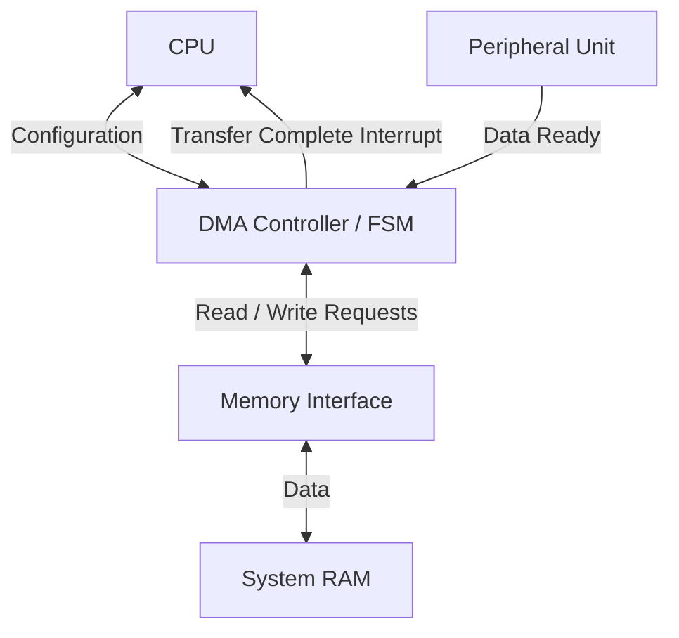
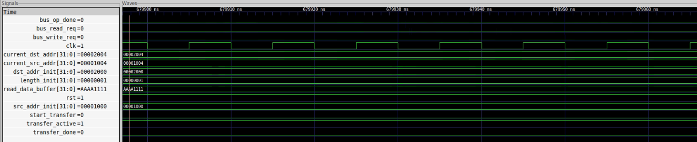

# Direct Memory Access (DMA) Engine

This repository contains the RTL design and implementation of a simplified AXI-based Direct Memory Access (DMA) engine. The primary purpose of this DMA engine is to offload memory-to-memory and peripheral-to-memory data transfers from the CPU, significantly improving overall system efficiency.

## Overview

In traditional CPU-driven transfers, every data word passes through the CPU, wasting valuable clock cycles. This DMA engine operates independently to manage data transfers between memory-mapped peripherals and system memory. 

### Architecture Diagram

## System Components

The project is structured into three main Verilog components:

### 1. Finite State Machine Controller (`dma_fsm.v`)
The core controller responsible for executing the transfer sequence.
- **State Logic**: Implements the state machine transitioning through `IDLE`, `READ`, `WAIT_READ`, `WRITE`, `WAIT_WRITE`, `INC_ADDR`, and `DONE`.
- **Address & Transfer Tracking**: Controls source and destination address increments and manages the remaining transfer byte count.
- **Control Signals**: Generates appropriate read/write requests to the memory bus.

### 2. Top-Level DMA Engine (`dma_engine.v`)
The top-level wrapper that integrates the FSM with the actual memory and peripheral interfaces.
- **Registers**: Manages source address, destination address, and transfer length registers.
- **Status Flags**: Outputs `busy`, `done`, and `error` statuses for the CPU to monitor.
- **Interrupts**: Asserts an interrupt signal to the CPU upon successful completion of a transfer block.
- **Data Buffering**: Buffers data read from the source before writing it to the destination.

### 3. Verification Testbench (`dma_fsm_tb.v`)
A comprehensive Verilog testbench used to verify the correct functioning of the DMA engine over multiple transfer operations.
- Simulates clock and reset signals.
- Mimics a memory/peripheral interface by toggling the `bus_op_done` acknowledgement.
- Asserts a sample transfer and waits for completion.

## Simulation and Waveforms

To simulate this design, you can use any standard Verilog simulator (e.g., ModelSim, Vivado Simulator, or Icarus Verilog). The testbench includes a `.vcd` dump which can be visualized using tools like GTKWave.

### DMA Transfer Waveform:

